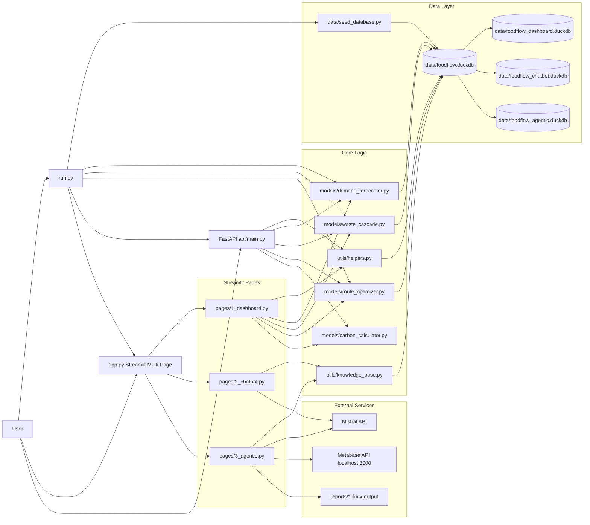
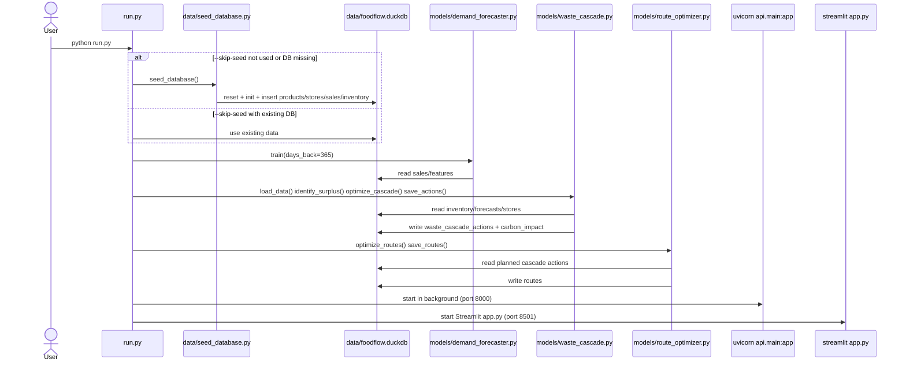
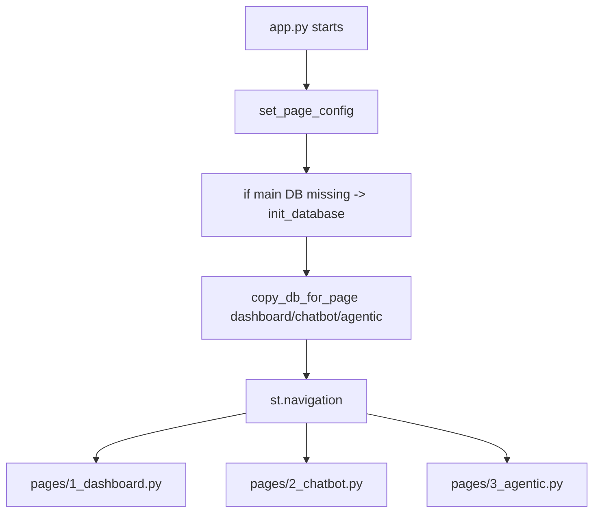
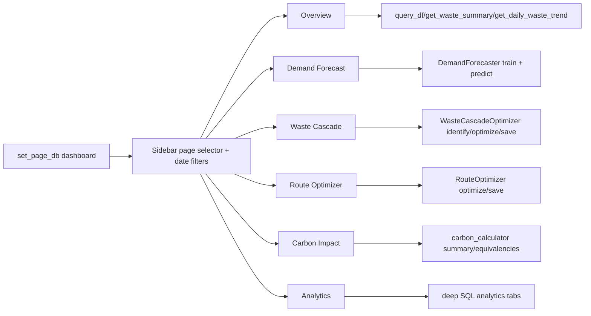
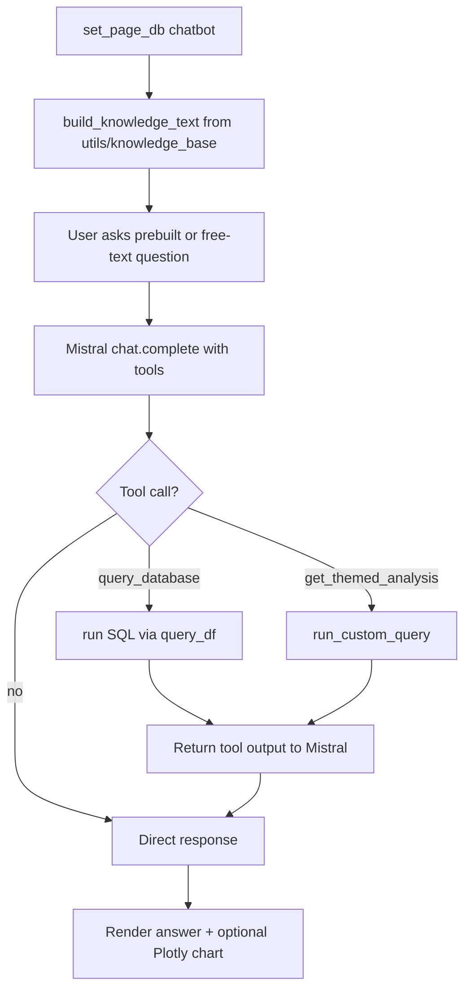
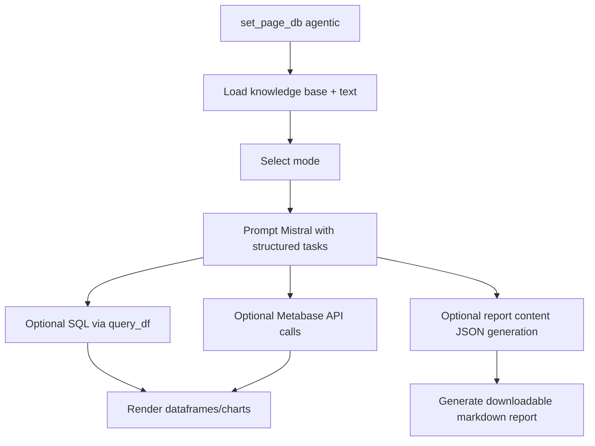
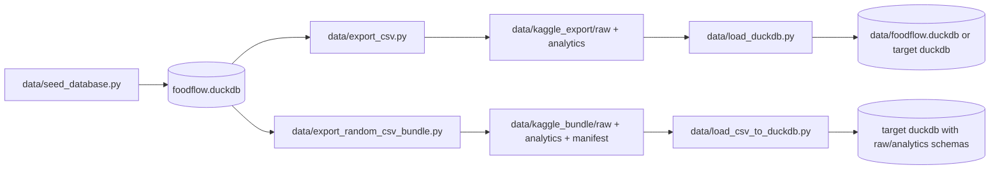
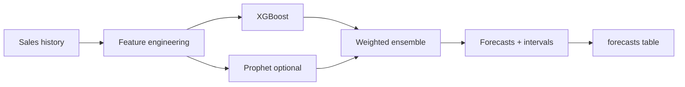
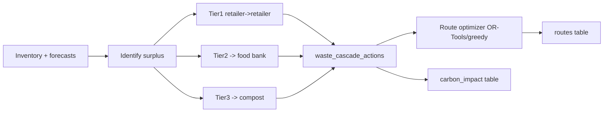

# FoodFlow AI Complete Project Workflow

This document maps the **full workflow** of the current codebase, from data generation to AI-powered dashboards and APIs.

Scope covered from code:
- `app.py`, `run.py`, `api/main.py`
- `pages/1_dashboard.py`, `pages/2_chatbot.py`, `pages/3_agentic.py`
- `models/*.py`, `utils/*.py`, `database/db.py`
- `data/*.py` export/load/seed pipeline
- Legacy standalone apps: `dashboard/app.py`, `chatbot/app.py`, `agentic/app.py`

---

## 1. High-Level Architecture



---

## 2. Boot & Runtime Sequence (`python run.py`)



---

## 3. Streamlit Multi-Page Workflow (`app.py`)



### Important DB behavior
- Each page calls `set_page_db("<page>")`.
- This creates/uses page-specific DuckDB copies (`foodflow_dashboard.duckdb`, etc.) to avoid locking.
- Main pipeline writes (from `run.py`) go to `foodflow.duckdb`.

---

## 4. Dashboard Page Workflow (`pages/1_dashboard.py`)



---

## 5. Chatbot Workflow (`pages/2_chatbot.py`)



Key elements:
- 20 prebuilt question templates with SQL + chart specs.
- Function-calling tools: `query_database`, `get_themed_analysis`.
- Knowledge context from `utils/knowledge_base.py`.

---

## 6. Agentic Workflow (`pages/3_agentic.py`)

Modes implemented:
1. Executive Summary
2. Deep-Dive Analysis
3. Client Report Generator
4. Live SQL Agent
5. Action Recommendations
6. Metabase Analytics (API/MCP-style actions)
7. Word Report Generator (markdown + existing docx integration)



---

## 7. API Workflow (`api/main.py`)

```mermaid
flowchart LR
    Client --> E0[/api/* endpoints]
    E0 --> E1[helpers + model modules]
    E1 --> DB[(foodflow.duckdb)]
    E1 --> JSON[JSON responses]
```

Endpoint groups:
- Overview: `/api/overview`, `/api/daily-waste-trend`
- Catalog: `/api/products`, `/api/stores`, categories
- Forecast: train, predict, metrics, surplus alerts
- Cascade: optimize, summary
- Routes: optimize, saved
- Carbon: summary, timeline
- Analytics: waste/category/store/top products/leaderboard
- Inventory + health checks

---

## 8. Data Engineering Pipeline



Outputs include:
- raw CSV tables
- analytics CSVs
- `dataset-metadata.json` for Kaggle
- optional DuckDB reload with schemas/views

---

## 9. Model-Specific Workflow

### Demand Forecasting


### Waste Cascade + Routes


---

## 10. Practical Run Paths

### Full system
```bash
python run.py
```

### Unified UI only
```bash
streamlit run app.py --server.port 8501
```

### API only
```bash
uvicorn api.main:app --reload --port 8000
```

### Seed only
```bash
python data/seed_database.py
```

---

## 11. Notes on Current Structure

- `app.py` + `pages/*` is the active unified app path.
- `dashboard/app.py`, `chatbot/app.py`, `agentic/app.py` are legacy standalone entrypoints still present.
- Main orchestration and training/cascade/route priming happen in `run.py`.

